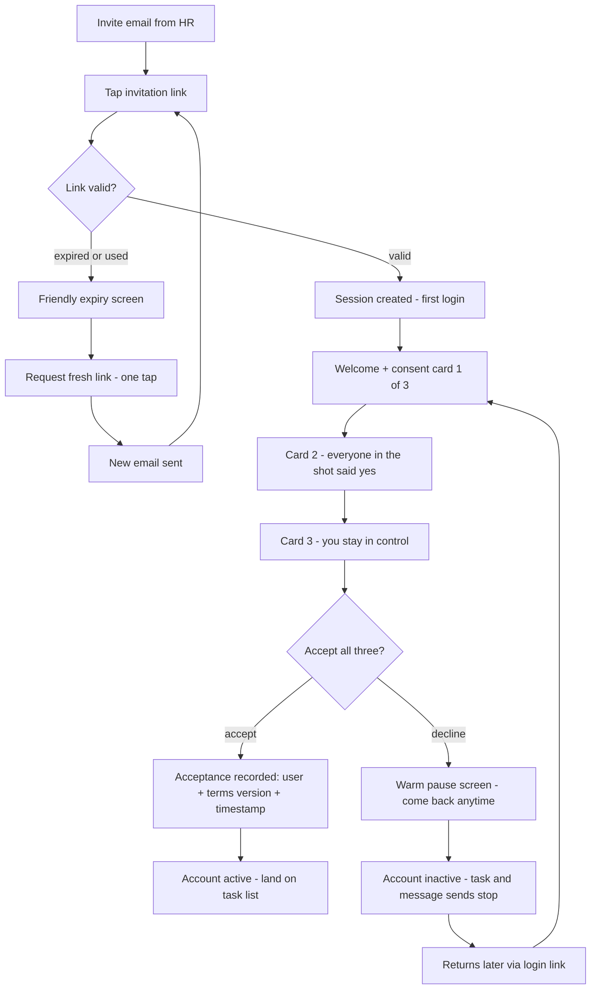
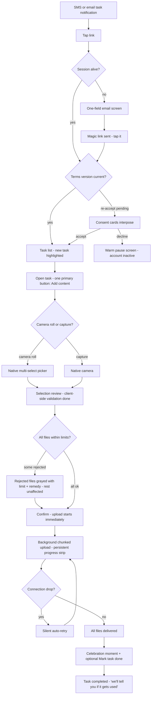
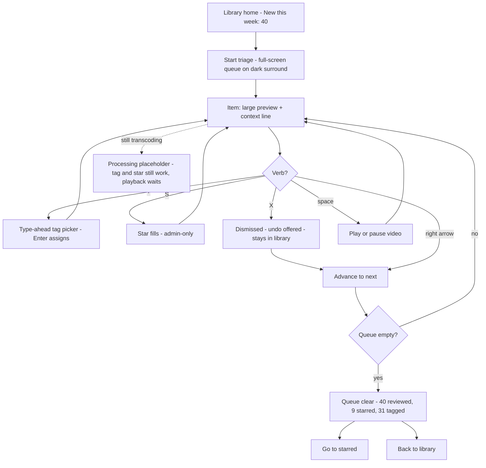
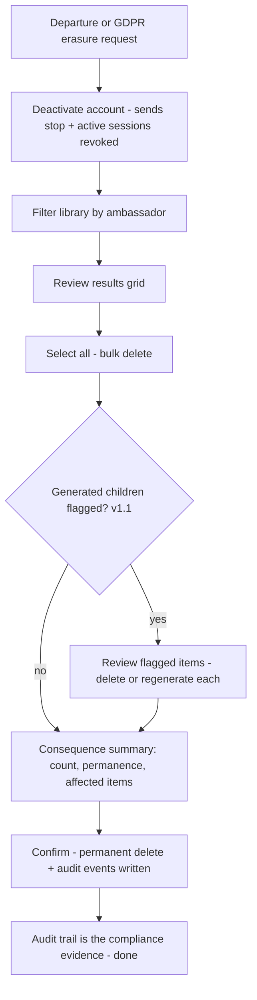
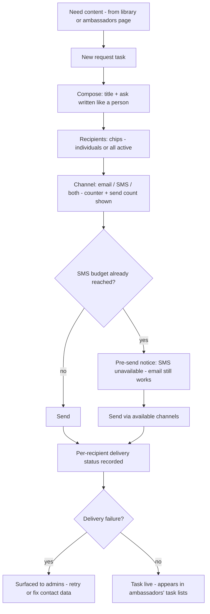

# UX Design Specification stena-content-portal

**Author:** Rasmus
**Date:** 2026-07-06

---

<!-- UX design content will be appended sequentially through collaborative workflow steps -->

## Executive Summary

### Project Vision

The Stena Content Portal is one web app with two deliberately different faces. For 10–20 employee ambassadors, it is a phone-first drop zone that fits a 90-second downtime moment: a task notification arrives, the camera roll opens, twelve photos upload in the background, done. For the small HR/marketing admin team, it is a desktop-first cockpit: an inbox-style triage queue, one shared library with filters and tags-as-folders, and a zip export with human-readable filenames — from "need content" to publish-ready asset in under 10 minutes. The UX thesis matches the product thesis: contribution must cost almost nothing, and curation must feel like one continuous motion rather than page-hopping.

### Target Users

**Jonas — the ambassador (primary, mobile).** Frontline employee, often on a vessel with patchy Wi-Fi. Interacts in stolen moments, one-handed, on iOS Safari or Android Chrome. Zero tolerance for passwords, forms, or uploads that die at 80%. Motivated by proof his content mattered ("your clip was used!"), demotivated by silence and rejection. Tech-savviness: ordinary consumer — native camera and camera roll are his mental model.

**Petra — the admin (primary, desktop).** HR/marketing generalist on a small shared-workspace team, working in batch sessions under campaign deadlines: 40 new uploads Monday morning, agency handoff Friday. Needs instant previews (even of 2 GB videos), single-action triage verbs, and findability in seconds. Occasionally checks in from a phone, but bulk operations live on the big screen. Also the GDPR operator: offboarding and erasure runbooks are her calm-15-minute procedures.

### Key Design Challenges

1. **The 90-second contribution moment.** Task link → signed in and at the point of action in < 3 s on 4G (MVP: the task list with the new task one tap from upload; v1.1 tokenized links land directly in the upload flow), batch selection without per-file forms, chunked auto-resume that makes network drops lossless, and client-side size validation that explains limits *before* pain. The upload experience is the product's make-or-break subsystem, and every state (queued, uploading, paused, processing, done) must read as "nothing you do can lose this."
2. **Triage at conveyor-belt speed.** An inbox-style queue where tag/star/skip is one motion per item — keyboard-driven on desktop (which doubles as the accessibility story), with pre-generated thumbnails rendering < 200 ms and graceful "processing" placeholders for fresh uploads.
3. **Consent as comprehension, not friction.** Three plain-language cards on first login (and on every terms change) that feel warm rather than legal, a decline path that reads as "paused, come back anytime" instead of a dead end, and self-service re-entry — all while producing evidence-grade acceptance records.
4. **One app, two optimized surfaces.** Phone-first ambassador flows and desktop-first admin flows must share one design system and one asset model without either experience feeling like the other's afterthought.
5. **Signal separation by design.** Stars and dismissals are admin-private; ambassadors only ever see positive signals. The UI must make it structurally impossible for triage signals to leak into ambassador-visible surfaces.
6. **Friendly failure everywhere.** Expired magic links, SMS budget caps, oversized files, transcoding in progress — every error path needs a plain-language explanation and a next step, never a raw provider error or a broken preview.

### Design Opportunities

1. **The task-as-trigger gesture is the signature UX.** Notification → open → camera roll → walk away, in one flow. If this feels effortless, the activation metric (≥ 70%) follows; every screen between Jonas and "upload started" is a place to lose him.
2. **The usage notification as the delight moment.** "Your photo was used in a published campaign!" is near-zero build cost with outsized retention impact — worth designing as a genuine micro-celebration, not a system toast.
3. **Consent cards as a brand moment.** First login is the program's handshake; three tappable cards done well set a tone of respect and control that a scrolled-past text wall never could.
4. **Triage keystrokes as power UX.** A photo-culling interaction model (J/K/S-style) turns Petra's worst chore into the tool's most-loved feature, and satisfies keyboard operability (WCAG) for free.
5. **Tags-as-folders: one primitive, familiar mental model.** Admins get the folder browsing they asked for with none of the sync machinery — the UX can lean fully on the folder metaphor while the model stays simple.

## Core User Experience

### Defining Experience

**The 90-second fulfillment** is the interaction that defines this product: a task notification arrives by SMS or email, Jonas taps through and is signed in and looking at the request within 3 seconds — one tap from the upload flow in MVP, directly in it once v1.1 tokenized links arrive — batch-selects from his camera roll in one gesture, and lets the upload run while he gets on with his day. No login form, no per-file metadata, no supervising a progress bar. If this loop feels effortless, the library fills and everything downstream works; if it costs more than 90 seconds of attention, the product fails regardless of how good the admin side is.

Its mirror on the admin side is **the triage rip**: Petra enters the "new this week" queue and processes 40 uploads in one sitting — preview, tag, star or skip, next — one motion per item, keyboard-driven, without ever leaving the queue. Contribution and curation are the product's two heartbeats; every other screen exists to serve one of them.

### Platform Strategy

- **One responsive web app, two optimized surfaces.** Ambassador surface designed phone-first (iOS Safari, Android Chrome — current and previous major version); admin surface designed desktop-first (evergreen Chrome, Edge, Firefox, Safari), usable on tablet/phone for checks but with bulk operations reserved for the big screen.
- **Touch-first vs. keyboard-first.** Ambassador UI is thumb-driven: large touch targets, one-handed reachability, bottom-anchored primary actions. Admin UI is keyboard-and-pointer: triage keystrokes, multi-select with modifier keys, hover states carrying secondary actions.
- **Native web capabilities, no native app.** Camera capture via `<input capture>`, camera-roll multi-select via the file picker; HEIC/HEVC quirks absorbed by the transcoding pipeline, never surfaced to the user.
- **Magic-link entry shapes all routing.** Every front door — invite, task notification, plain login — resolves through one link-consumption flow into a long-lived session. Link expiry gets a friendly "request a new link" path, since email/SMS is the *only* way in.
- **No offline mode by design.** Connectivity resilience lives in the upload layer (chunked auto-retry), not in offline-first architecture. The UI communicates upload state honestly so ambassadors know when it is safe to switch away (transfers pause) and that returning resumes without loss.

### Effortless Interactions

- **Logging in** — ambassadors never see a password or a login form; the link *is* the login.
- **Batch upload** — select many, tap once; metadata (task linkage, ambassador, date) is created by the workflow, not typed into forms; descriptions are optional and can come later.
- **Surviving bad connectivity** — drops and retries are invisible; the ambassador never sees an error for something the system can heal itself.
- **Being told "no" early** — size/type validation happens before the upload starts, stating the limit and the remedy ("Videos can be up to 2 GB / ~5 min — trim the clip and try again").
- **Triage verbs** — tag, star, skip as single keystrokes/taps in the queue; no per-item page loads, no confirmation dialogs for reversible actions.
- **Finding anything** — filters (ambassador, type, date, tag-folder) and search respond in < 500 ms; tags browse as folders, matching the mental model admins already have.
- **Previews** — thumbnails just appear (< 200 ms in viewport); fresh uploads show a calm "processing" state, never a broken image.
- **Export naming** — the zip arrives with `{ambassador-name}-{upload-date}-{nn}` filenames automatically; nobody ever renames `IMG_4417.MOV` again.

### Critical Success Moments

1. **The first-login handshake.** Invite email → three consent cards → active account, in under a minute. This is where trust is established — and where a confusing legal wall would kill activation before the first upload.
2. **The first interrupted upload that heals itself.** Jonas gets pulled away mid-transfer on ship Wi-Fi and comes back to find the upload resuming exactly where it left off — no error, no lost progress. The moment he learns nothing he does can break it is the moment contribution becomes habitual.
3. **"Your photo was used!"** The usage notification is the retention moment — proof that contributions don't vanish into a silent hole. Designed as a micro-celebration, not a system toast.
4. **The Monday triage session.** Petra clears 40 uploads in one sitting and feels *faster* than her old workflow for the first time. If the queue feels like a chore, the library rots untagged.
5. **The zip handoff.** The export opens with human-readable filenames, publish-ready. This is where the "under 10 minutes" promise lands and the tool proves itself to the agency and stakeholders.
6. **Failure moments that must not ruin trust:** an expired magic link (one tap to a fresh one), an oversized video (limit explained before upload), a declined consent (warm "come back anytime"), a budget cap hit (plain words, named action). Each of these is a designed experience, not an error state.

### Experience Principles

1. **The task is the trigger.** Design the entry points before the screens — every notification is a front door that must land the user directly at the point of action.
2. **Interruption-safe.** Any long-running process (upload, transcoding, export) survives interruption without loss or error. Platform honesty: web uploads pause while the app is backgrounded or the phone locked (iOS Safari has no background transfer) and resume automatically on return — the system reports state truthfully, including when it needs the app kept open, and never demands supervision beyond that.
3. **One motion per intent.** Batch selection in one gesture, one keystroke per triage verb, multi-select for every bulk operation. If an intent takes three interactions, redesign it.
4. **Praise in public, triage in private.** Every signal is classified as praise (ambassador-visible) or triage (admin-only) before it gets a UI. No exceptions, no leaks.
5. **Soft edges.** Every limit, failure, or decline explains itself in plain language and offers a way back. No dead ends, no raw provider errors, no punishment.
6. **Two surfaces, one system.** Phone-first for contribution, desktop-first for curation — one design language, one asset model, no second-class experience.

## Desired Emotional Response

### Primary Emotional Goals

**Ambassadors — appreciated, trusted, unburdened.** Contribution should feel like a favor casually done, not a chore assigned: "that took 90 seconds and someone actually valued it." The emotion that drives retention is quiet pride — proof of use replacing the silent hole where contributions used to disappear. The emotion that drives activation is safety: nothing here can embarrass me, trap me, or waste my time.

**Admins — calm competence at speed.** Petra should feel like the tool is an extension of her hands on deadline morning: momentum in the triage queue, certainty in search, confidence at export. Even the scary parts of her job — permanent deletion, GDPR requests — should feel like following a well-lit path rather than defusing a bomb.

**Program-wide — mutual trust.** Every consent screen, every notification, every erasure honors the deal: you share your likeness, we treat it with respect and proof. That feeling is the product's license to operate.

### Emotional Journey Mapping

| Stage | Desired feeling | Never |
|---|---|---|
| Invitation email | Curiosity, feeling chosen — "HR picked *me*" | Obligation, suspicion of spam |
| First-login consent | Respected, informed, unhurried | Legal intimidation, being rushed |
| Task notification | "I can knock this out now" | Nagging, guilt |
| Upload in progress | Relief — free to walk away | Hostage to a progress bar |
| Decline terms | Unpunished, door left open | Shame, finality |
| Return after decline | Welcomed back, no questions asked | Having to explain yourself |
| Usage notification | Genuine pride, a small win worth mentioning at coffee | Generic system noise |
| Admin triage session | Flow, momentum, visible progress through the pile | Drudgery, dread of the backlog |
| Export & handoff | Accomplishment, professional pride | Last-minute file-renaming panic |
| Offboarding / erasure | Calm procedural control | Panic, fear of missing something |
| Any error | Informed, with an obvious next step | Blame, confusion, dead ends |

### Micro-Emotions

- **Trust vs. skepticism** — the make-or-break pair. Built in three places: consent (plain language, real control), uploads (survives bad networks, state never lies), previews (never broken, never stale). Lost once, an ambassador stops contributing forever.
- **Confidence vs. confusion** — every screen answers "what's happening and what can I do next?" without reading anything twice; processing states, link expiry, and budget caps all narrate themselves.
- **Accomplishment vs. frustration** — both surfaces end sessions on a completed loop: task marked done, queue cleared, zip downloaded. Progress is always visible ("12 of 40 triaged").
- **Appreciated vs. invisible** — the usage counter and notification are the only public signals, and they are all positive. Being seen is the ambassador program's fuel.
- **Calm vs. anxiety** — deliberate calm in the danger zones: permanent deletes get clear consequence lists (including generated children), not red flashing warnings; GDPR flows read like a checklist, not an alarm.
- **To avoid entirely:** rejection (stars/dismissals never leak), guilt (declines and unfulfilled tasks never scold), dread (no error ever looks like data loss when data is safe).

### Design Implications

- **Trust → honest state.** Upload progress reflects reality (chunks, retries absorbed silently); "processing" placeholders promise and deliver; no optimistic UI that can betray.
- **Feeling chosen → personal touch at entry.** Invitation and task notifications name the sender and the purpose ("Petra needs Midsummer deck photos"), not "You have a new task (1)."
- **Pride → designed celebration.** The usage notification gets celebratory visual language and specific context ("your photo — used in the summer recruiting campaign"), plus the ticking profile counter. Small, genuine, never cheesy.
- **Safety → reversibility where possible, clarity where not.** Triage verbs toggle freely (star/unstar, tag/untag); the few irreversible acts (delete) state consequences plainly and specifically.
- **Flow → zero interruptions in the queue.** No modals, no page loads, no confirmation prompts for reversible actions during triage; keyboard advances automatically to the next item.
- **Warmth in failure → soft-edge copy pattern.** Every error names what happened, why, and the remedy, in the same friendly register as the rest of the app ("This link has expired — tap here and we'll send a fresh one").
- **Calm in governance → procedural framing.** Deletion and offboarding flows are structured as steps with confirmation summaries — the UI equivalent of the runbook Petra already trusts.

### Emotional Design Principles

1. **Warm, human voice everywhere** — consent, errors, and empty states sound like a helpful colleague, never like legal or a server.
2. **Celebrate use, never rank shame** — positive signals are amplified and public; evaluative signals stay private, always.
3. **Calm is a feature** — the scarier the operation (permanent delete, erasure, re-consent), the quieter and clearer the design.
4. **Trust is earned in failure** — error and edge moments get the most design attention, because that's where trust is won or lost.
5. **Protect the flow** — nothing interrupts a triage rip or a walk-away upload; the system waits for the user, never the reverse.

## UX Pattern Analysis & Inspiration

### Inspiring Products Analysis

**WhatsApp / Instagram (ambassador mental model — media sharing).** The gold standard Jonas already knows: open, tap attach, multi-select from the gallery grid, send, pocket the phone. Zero forms, zero configuration, progress shown but never blocking. Their lesson: media sharing is a *gesture*, not a workflow — any screen the portal adds beyond "pick and go" is friction Jonas's muscle memory doesn't expect.

**Google Photos (upload trust).** The masterclass in walk-away-safe: backup happens in the background, a quiet status line ("Backing up 3 of 12") tells the truth, interruptions self-heal, and "Backup complete" is a felt moment of relief. Their lesson: communicate upload state as *reassurance*, not as a task the user must supervise.

**BeReal / Duolingo notifications (task-as-trigger).** Products built on a notification that leads directly into a single, immediately completable action. Their lesson: the notification must carry context ("Petra needs Midsummer deck photos") and the landing must be the action itself — every intermediate screen bleeds completion rate.

**Gmail / Superhuman (admin triage).** Inbox-style processing with single-keystroke verbs (archive, label, star), auto-advance to the next item, and a visible path to zero. Superhuman proved keyboard-driven triage can feel like a game. Their lesson: triage speed comes from *auto-advance plus reversible verbs* — no confirmations, no page loads, momentum as the reward.

**Lightroom culling / Frame.io (media review).** Lightroom's flag-and-star pass over hundreds of shots is exactly Petra's Monday: full-screen preview, rate with one key, arrow to next. Frame.io shows how video review stays lightweight (hover-scrub thumbnails, instant playback). Their lesson: previews must be instant and evaluation must never require opening a detail page.

**Slack / Notion (magic-link login).** Passwordless entry done warmly: plain-language emails ("Tap the button below and you're in"), graceful expiry with instant re-request. Their lesson: the login email is a UI surface — design it like a screen, not a system message.

### Transferable UX Patterns

**Navigation & entry:**
- **Deep-landing notifications** (BeReal): task link → upload screen directly; login resolves invisibly in between.
- **Single-purpose mobile surface** (WhatsApp): the ambassador app is a short stack — tasks, upload, my uploads, profile — with the primary action always thumb-reachable.
- **Folders-as-views** (Google Drive familiarity): tags browse like folders, satisfying the mental model without a second taxonomy.

**Interaction:**
- **Gallery-grid multi-select** (Instagram): tap-to-toggle selection with counters, then one confirm — the exact camera-roll gesture Jonas knows.
- **Quiet background progress** (Google Photos): persistent but unobtrusive upload status; state survives navigation away and back.
- **Keystroke triage with auto-advance** (Superhuman/Lightroom): tag, star, skip on keys; the queue advances itself; a running "12 of 40" counter feeds momentum.
- **Hover-scrub video previews** (Frame.io): evaluate a clip without opening it.

**Visual:**
- **Media-first, chrome-light** (Instagram/Lightroom): the content is the interface; controls overlay or sit in slim bars, letting photos and videos dominate every screen.
- **Status as calm text, not spinners** (Google Photos): "Processing preview — ready soon" reads calmer than an animated placeholder.
- **Celebration with restraint** (Duolingo, dialed down): the usage notification gets one joyful moment — color, an icon, the specific campaign name — without streaks, badges, or pressure mechanics.

### Anti-Patterns to Avoid

- **The metadata tollbooth** (enterprise DAM/CMS uploads): required per-file titles, categories, and rights fields before upload starts. This kills the 90-second moment; metadata comes from workflow context or later admin tagging, never from Jonas's thumbs.
- **The EULA wall** (every consent flow users hate): a scrolled-past legal text with one "I agree" checkbox. The three-card pattern exists precisely to avoid this; never collapse it back into a wall.
- **Supervised uploads** (old file managers): progress modals that block navigation, "don't close this window" warnings, and failures that discard completed work. Chunked resume makes all of this unnecessary — the UI must act like it.
- **Guilt mechanics** (Duolingo's dark side): streak-shaming, "you haven't uploaded in a while" nudges, public rankings of laggards. The leaderboard (v1.1) shows only the top 5 — never who's last — and task reminders stay factual, not emotional.
- **Confirmation-dialog triage** (legacy admin panels): "Are you sure you want to star this?" Reversible verbs never confirm; only permanent deletion earns a dialog, and that dialog lists real consequences instead of asking a rhetorical question.
- **Broken-image previews** (naive media libraries): a torn-image icon while transcoding runs reads as data loss. Always render a designed processing placeholder with the original filename visible.

### Design Inspiration Strategy

**Adopt outright:** gallery-grid multi-select for camera-roll upload (Instagram); quiet background upload status (Google Photos); keystroke-plus-auto-advance triage (Superhuman/Lightroom); warm magic-link emails (Slack/Notion).

**Adapt:** deep-landing notifications (BeReal) — MVP links land on the task list post-login since tokenized deep links arrive in v1.1, so the task list itself must put "fulfill" one tap away; hover-scrub previews (Frame.io) — desktop hover-scrub, mobile tap-to-play inline; celebration moments (Duolingo) — one-shot delight on usage notifications, no retention mechanics.

**Avoid:** metadata tollbooths, EULA walls, supervised uploads, guilt mechanics, confirmation-dialog triage, broken-image states — each conflicts directly with an experience principle (one motion per intent, soft edges, interruption-safe, praise in public).

## Design System Foundation

### Design System Choice

**Themeable foundation: Tailwind CSS design tokens + a headless accessible component layer (shadcn/ui with Radix primitives if the architecture lands on React; the equivalent headless library otherwise — e.g. Radix Vue/PrimeVue Unstyled for Vue).** Custom-built components for the media-specific surfaces: triage queue, upload manager, gallery grid, consent cards, and media preview. The framework decision itself remains with architecture; this choice is binding at the level of approach, tokens, and component strategy.

### Rationale for Selection

- **The signature components are custom anyway.** No off-the-shelf system ships a photo-culling triage queue, a chunked-upload manager, or a consent-card flow. The design system's job is to supply accessible primitives (dialogs, dropdowns, forms, toasts, tabs) and consistent tokens underneath the custom surfaces — headless libraries do precisely this without visual baggage.
- **Media-first demands chrome-light.** Material and Ant impose strong visual identities that compete with content. A token-driven Tailwind approach lets the UI recede to slim bars and overlays, keeping photos and videos dominant on every screen.
- **Accessibility comes from the primitives.** Radix-style headless components deliver keyboard operability, focus management, and ARIA semantics out of the box — carrying most of the WCAG 2.1 AA intent without a compliance project.
- **Right-sized for the team.** A 1–3 developer team gets copy-in components they own outright (no library-upgrade treadmill), the largest ecosystem of examples, and the best AI-assisted development support of any current approach.
- **Two surfaces, one token set.** Shared color, type, spacing, and radius tokens keep the phone-first ambassador surface and the desktop-first admin cockpit visibly one product while their layouts diverge freely.

### Implementation Approach

- **Design tokens first:** a single token file (colors, typography scale, spacing, radii, shadows, motion durations) consumed by both surfaces. **Color and typography tokens are sourced exclusively from Stena's official brand guidelines** (requested from stakeholder — pending): brand colors mapped into semantic roles (primary action, positive/celebration, caution, destructive, neutral chrome), brand fonts as the only typefaces. Until the guidelines arrive, all visual work uses a clearly-marked placeholder neutral palette and system font stack so nothing placeholder can be mistaken for final.
- **Primitive layer:** headless components themed once with the tokens — button, input, dialog, dropdown, toast, tabs, badge, checkbox, progress.
- **Custom component layer** (the real design work, specified later in this document): TriageCard + queue shell, UploadManager (batch progress, retry states), GalleryGrid (selection model, lazy thumbnails), ConsentCard stack, MediaPreview (image/video with processing state), TagPicker (create + assign in one control), NotificationCelebration.
- **Density modes:** default comfortable density on the ambassador surface (touch targets ≥ 44 px), compact density on admin data surfaces — same tokens, one spacing multiplier.

### Customization Strategy

- **Brand fidelity as a hard constraint:** the UI uses *only* colors, typefaces, and visual rules from Stena's brand guidelines — no off-palette colors, no additional fonts. Brand accents appear in semantic roles (actions, highlights, celebration moments) over the guidelines' neutral base; media stays the hero. Where the guidelines are silent (semantic states, tints/shades for hover and focus, contrast-driven adjustments for WCAG AA), values are derived from the brand palette and listed for stakeholder confirmation. **Open dependency:** official Stena brand guidelines document — owner: Rasmus, requested from stakeholder. Confirm the guidelines include a digital/UI palette (not print-only) and that brand fonts are licensed for web embedding.
- **Dark-neutral option for media review:** the triage queue and library benefit from a dim neutral background (photo-culling convention — Lightroom); to keep MVP scope tight this is a token-level decision for those surfaces, not a user-facing theme toggle.
- **Voice as a design token:** the warm, human copy register (soft-edge errors, celebration moments) is documented alongside visual tokens so every new component inherits it.
- **No fork risk:** because components are copied in, not imported, the team can freely specialize (e.g., keystroke handling in TriageCard) without fighting upstream updates.

## Core Experience Deep-Dive

### The Defining Interaction

**"HR asked — I sent 12 photos before my coffee got cold."** The defining experience is fulfilling a content request from a phone in one sitting: a message arrives with a real ask from a real person, and within 90 seconds the photos are on their way and Jonas is back to his day. It's what an ambassador would describe to a colleague: *"They text me when they need something, I pick the shots, done — and later it tells me if they used them."* Everything else in the product — consent, transcoding, triage, export — exists so this exchange can be this short.

The supporting-actor experience on the admin side is **the triage rip** (clear 40 new uploads in one sitting); it gets its own mechanics below because the two loops feed each other: requests fill the queue, triage proves the requests were worth answering.

### User Mental Model

- **Jonas's model is messaging, not filing.** Today he already fulfills content requests — in a chat thread: someone asks, he opens the gallery, multi-selects, sends. The portal must map 1:1 onto that gesture. Anything that smells like "uploading to a system" (forms, folders, required fields) breaks the model; anything that feels like "replying with photos" fits it.
- **What he hates about the current way:** no idea if the files arrived, whether they were usable, or whether anyone cared; big videos fail in chat apps; and a nagging uncertainty about what the company may do with his material. The portal wins by answering all three: honest upload state, proof of use, explicit consent he controls.
- **His expectations:** the link in the message takes him *to the thing* (not a homepage); selection looks like his native gallery; progress doesn't hold him hostage; done means done.
- **Likely confusion points to design against:** logging in when his session has expired (must be one tap to request a link, and the email must arrive fast); the difference between "uploaded" and "processing" (he should never care — uploaded is done, processing is the admin's concern); whether marking the task done is required (it isn't — but it's one satisfying tap, offered right after upload).

### Interaction Success Criteria

- **Notification → native picker open in ≤ 3 taps** with a live session (open link → task card → Add content); selection plus one confirm starts the upload. The KPI is defined exactly so: *picker in ≤ 3 taps, upload started with exactly one confirm after selection.* (PRD NFR1's "upload screen in < 3 s" reads as point-of-action in MVP and becomes literal with v1.1 tokenized links — flagged for PRD wording sync.)
- **Zero typing on the happy path:** with a live session nothing is typed end-to-end — no forms, no mandatory descriptions. The one typing moment in the product is the email field on the expired-session detour; everywhere else typing is optional enrichment.
- **The interruption test (platform-honest):** iOS Safari cannot upload while the phone is locked or the browser backgrounded — so the promise is *lossless*, not *background*: switching apps or losing signal pauses the transfer safely, and it resumes the moment the portal is foregrounded, with zero lost chunks and zero error states. The strip says so plainly ("3 of 12 delivered — safe to switch apps, we'll resume").
- **The retry is invisible:** connection drops never surface unless recovery is truly impossible; then the message says what happened and that retrying is automatic.
- **Rejection happens before waiting:** an oversized file is caught at selection, named specifically ("engine-tour.mp4 is 3.2 GB — videos can be up to 2 GB / ~5 min"), and never wastes transfer time.
- **Feels done:** a single completion moment (all files delivered + optional "mark task done") ends the session with a full stop, not a shrug.

### Novel UX Patterns

**This is deliberately a non-novel experience** — the innovation is in what's *removed*, not what's invented. Every mechanic is an established consumer pattern: gallery multi-select (Instagram/WhatsApp), background upload with quiet status (Google Photos), magic links (Slack/Notion), inbox triage (Gmail/Lightroom). No user education is needed, and that's the point: adoption depends on zero learning curve for a non-captive audience of ~20 busy employees.

The two places we combine familiar patterns in a mildly novel way:

- **Task-scoped upload:** the upload screen carries the request's context ("Midsummer deck photos — for Petra") and auto-links content to the task. Familiar pieces (chat reply, file attach), new combination (provenance created by workflow, invisible to the user).
- **Praise-only feedback loop:** consumer apps give likes from peers; here the only social signal is institutional and always positive ("your photo was used"). Novel in policy, not in interaction — it renders as a familiar notification + counter.

### Experience Mechanics

**A. The 90-second fulfillment (ambassador, mobile)**

1. **Initiation.** SMS/email arrives, written like a person: "Hi Jonas — we need Midsummer deck photos for a recruiting campaign. Tap to help: [link]". Tap → if session alive (the common case; sessions are long-lived by design), land directly on the task list with the new task highlighted; if expired, a one-field screen (email, pre-filled when possible) → "Link sent — check your email" → tap → task list. MVP accepts this login detour; v1.1 tokenized links remove it for 1:1 sends.
2. **Interaction.** Task card shows the ask, who's asking, and one primary button: **Add content**. Tapping it opens the native picker in multi-select (camera-roll-first; "Take photo/video" as secondary). Jonas toggles 12 thumbnails, taps confirm. Selection screen shows the picks with per-file size validation already applied — any rejected file appears grayed with the specific reason and the rest proceed unaffected.
3. **Feedback.** A slim, persistent progress strip ("Uploading 3 of 12 — safe to switch apps, we'll resume") — never a modal. Files tick from queued → uploading → delivered; drops and retries change nothing visible except pace; backgrounding pauses, foregrounding resumes with the strip reflecting true state. Optional per-file description fields sit below, ignorable.
4. **Completion.** When the last file lands: "12 photos delivered 🎉 — Mark task as done?" One tap closes the loop (or skip — either side can mark done later). The task moves to "Completed." **MVP copy promises nothing MVP can't deliver** — the *"we'll tell you when it gets used"* line ships together with the v1.1 usage notifications, never before (per "no optimistic UI that can betray").

**A2. Spontaneous upload (Upload tab, no task):** the bottom-nav Upload tab opens the same picker in ≤ 2 taps. No task context exists, so the flow adds exactly one optional field — "What's this from?" — and nothing else; the UploadManager behaves identically. On the admin side the asset lands in the same "new this week" queue with its context line reading *ambassador · spontaneous · date*, so unrequested content is triaged in the same pass as requested content.

**B. The triage rip (admin, desktop)**

1. **Initiation.** Library home shows "New this week: 40" as the primary card. Click → full-screen triage queue, first item loaded, keyboard legend visible until first use.
2. **Interaction.** One asset at a time, large preview (hover-scrub for video), context line (ambassador, task, date, size). Verbs on single keys: **T** tag (type-ahead picker, Enter assigns), **S** star, **→/space** next, **←** back, **X** dismiss from queue. Mouse equivalents on-screen for non-keyboard admins. All verbs reversible; none confirm.
3. **Feedback.** Instant visual acknowledgment per verb (star fills, tag chip appears), auto-advance on next/dismiss, progress "12 of 40" with a thin bar. Items still transcoding show the designed processing placeholder — star/tag still work; only playback waits.
4. **Completion.** "Queue clear — 40 reviewed, 9 starred, 31 tagged" with two exits: **Go to starred** (the campaign path) or **Back to library**. The empty queue is a designed moment — Monday's pile is gone and it shows.

## Visual Design Foundation

### Color System

**Source: Stena Line brand guidelines (received 2026-07-06). These are the only colors in the product — no off-palette values.** Blue and red dominate per brand rule; white or black text always, per the brand accessibility rule.

**Brand palette (verbatim):**

| Color | Hex | Brand role |
|---|---|---|
| Core Blue | `#034592` | Primary brand color, dominant |
| Core Red | `#e41f1f` | Primary brand color, dominant |
| White | `#ffffff` | Standard background |
| Black | `#1a1a1a` | Text color / dark background |
| Beige | `#eae3d2` | Text-box/panel background |
| Light Blue | `#cbe1f6` | Nuance of Core Blue — internal use only |
| Pink | `#fbd4cd` | Nuance of Core Red — internal use only |
| Blue (link) | `#3344dd` | Online link highlighting |
| Green | `#1c5e38` | **Reserved: "Better Choice" only — not used in the portal** |
| Yellow | `#feca3a` | **Reserved: Easter only — not used in the portal** |

**Semantic token mapping:**

| Token | Value | Text on it | Contrast | Usage |
|---|---|---|---|---|
| `surface` | White `#ffffff` | Black | 17.4:1 | Default background everywhere |
| `surface-panel` | Beige `#eae3d2` | Black | 13.6:1 | Cards, consent cards, task cards, side panels (its exact brand purpose) |
| `surface-media` | Black `#1a1a1a` | White | 17.4:1 | Triage queue, media previews, lightbox — photo-culling dark surround |
| `action-primary` | Core Blue `#034592` | White | 9.25:1 | Primary buttons, active nav, selected filters, progress bars |
| `link` | Blue `#3344dd` | on White | 6.97:1 | Hyperlinks, "request new link," inline actions (brand-designated link color) |
| `focus-ring` | Blue `#3344dd` | — | ≥3:1 | 2 px visible focus indicator on all interactive elements |
| `info / selected-bg` | Light Blue `#cbe1f6` | Black | 12.96:1 | Selected items, highlighted new task, info banners, processing placeholders |
| `destructive` | Core Red `#e41f1f` | White | 4.65:1 (AA) | Delete buttons, error text/icons on white |
| `caution-bg` | Pink `#fbd4cd` | Black | 12.76:1 | Delete-consequence panels, budget-reached notices, soft-edge error surfaces |
| `celebration` | Core Blue on Light Blue | Black/Core Blue | AA+ | Usage notifications, "queue clear," upload-complete moments — brand-blue joy, not green |
| `star` | Core Blue `#034592` (filled) | — | — | Admin star signal (yellow is brand-restricted) |

**Usage rules:**
- Blue leads, red punctuates: Core Blue is the workhorse (actions, active states, celebration — selection belongs to Light Blue per the disambiguation rule below); Core Red appears *only* for destructive/error meaning so its signal stays unambiguous.
- Light Blue/Pink never leave the app: outbound email/SMS templates use Core Blue, white, black only.
- Media is the hero: chrome stays white/beige/black; saturated color appears only on interactive or semantic elements, never decoration.
- **Blue never stacks meanings:** selection is always Light Blue (ring/tint with a black check), the star is the only Core Blue mark permitted on top of media, progress and celebration surfaces never co-occur with selectable grids, and link-blue belongs to text links and focus rings alone. If a view would need Core Blue to mean two things at once, one meaning moves to Light Blue or black.

**Derived values — APPROVED 2026-07-08** (see `launch-decisions.md`): (a) **blue-based success/celebration** (Core Blue on Light Blue) — green stays brand-reserved for "Better Choice"; (b) **Core Blue filled star** (yellow stays brand-reserved for Easter); (c) **hover/pressed states = programmatic tints/shades of Core Blue at ±8–12% lightness**. The Fleet Deck token set is now fully locked.

### Typography System

**Font family: Inter (resolved 2026-07-08).** No official Stena brand typeface or webfont license exists, so the UI uses **Inter** (SIL Open Font License, free for web embedding) as the single UI typeface. **Self-hosted** — bundle woff2 in the app / serve from our EU origin; do **not** load from the Google Fonts CDN (leaks visitor IPs to Google, a GDPR concern inconsistent with this project's EU-data posture). Inter covers Swedish glyphs (å ä ö) and supports tabular numerals (`font-feature-settings: "tnum"`) for counts. Fallback stack for load resilience: `Inter, -apple-system, "Segoe UI", Roboto, Helvetica, Arial, sans-serif`.

**Type scale (validate against Inter's metrics during Story 1.3; the 16 px mobile input minimum is non-negotiable):**

| Token | Size / line height | Weight | Usage |
|---|---|---|---|
| `display` | 28 / 34 | 700 | Celebration moments, empty-queue completion |
| `h1` | 24 / 30 | 700 | Screen titles |
| `h2` | 20 / 26 | 600 | Section heads, card titles, consent card headings |
| `h3` | 17 / 24 | 600 | Sub-sections, dialog titles |
| `body` | 16 / 24 | 400 | Default text; 16 px minimum on mobile (prevents iOS zoom) |
| `body-sm` | 14 / 20 | 400 | Metadata lines, helper text |
| `caption` | 12 / 16 | 500 | Timestamps, counters, badges — tabular numerals for counts |

Sentence case everywhere (matches the warm voice); no all-caps except tiny badge labels; bold reserved for actions and emphasis, never whole paragraphs.

### Spacing & Layout Foundation

- **4 px base unit;** scale: 4, 8, 12, 16, 24, 32, 48, 64.
- **Ambassador surface (phone-first):** single column, 16 px side margins, primary CTA bottom-anchored in the thumb zone, touch targets ≥ 44 px, one primary action per screen.
- **Admin surface (desktop-first):** 12-column grid, content max-width 1440 px, left filter rail 256 px, compact density (32 px list rows, 8 px gaps); triage queue runs full-bleed on `surface-media` with overlay controls.
- **Media grids:** square (1:1) thumbnail cells in library/gallery, 4 px gaps mobile / 8 px desktop; aspect-fit previews in triage and lightbox.
- **Elevation & shape:** flat-first — borders and beige panels over shadows; one soft shadow level for overlays/dialogs; 8 px radius on cards/panels, 6 px on controls (derived — adjust if brand guide specifies radii).

### Accessibility Considerations

- **AA is the floor everywhere** (brand rule + NFR18); the brand's published contrast table is adopted as the pairing law: white text on dark backgrounds, black text on light backgrounds, no exceptions.
- **Core Red + White is AA for normal text (4.65:1)** — sufficient for buttons/labels; never place Core Red text on beige/pink surfaces without checking (use black text + red icon instead).
- **Text over photos/video always sits on a scrim** (black at 40–60% opacity, white text) — thumbnails and previews never carry bare text.
- **Color never carries meaning alone:** star = icon + state, errors = icon + text, processing = label + placeholder; focus ring visible on every interactive element; full keyboard operability per the triage design.
- **Motion respects `prefers-reduced-motion`;** celebration moments have a static variant.

## Design Direction Decision

### Design Directions Explored

Six directions were generated in an interactive showcase (`_bmad-output/planning-artifacts/ux-design-directions.html`), all constrained to the Stena Line palette, each rendering the same two reference screens (ambassador task list on phone, admin library on desktop): **1 Fleet Deck** (white base, beige panels, blue actions — the literal brand translation), **2 Gallery White** (hairline minimalism, chrome nearly invisible), **3 Dark Cockpit** (entire app on brand Black, pro-tool feel), **4 Hybrid Stage** (light chrome, brand-Black media stage), **5 Card Deck** (beige page, floating white cards, large radii), **6 Brand Bold** (Core Blue app bar, solid-blue selection, red attention badges).

### Chosen Direction

**Direction 1 — Fleet Deck**, chosen as-is. White as the standard background (per brand), beige panels for cards and grouped content (beige's exact brand-designated purpose), Core Blue carrying every action and active state, Light Blue for selection/new/info states, and red reserved strictly for destructive meaning.

### Design Rationale

- **Most faithful brand translation:** white background as standard, beige as the text-box/panel color, blue dominant — the app applies the brand guide's own rules rather than reinterpreting them.
- **Warmth serves the primary emotional goals:** beige panels give the ambassador surface the soft, safe, human feel the consent flow and task cards need; nothing about it reads as corporate legal or pro-tool intimidation.
- **Calm hierarchy for admin work:** filled beige panels group content more legibly than hairlines at a glance, supporting fast scanning in triage sessions without the visual weight of dark UI.
- **Preserves the color-meaning system intact:** unlike Brand Bold, red stays exclusively destructive; unlike Dark Cockpit, the consent and onboarding moments stay light and welcoming.
- **Known trade-off, accepted:** beige-everywhere can flatten hierarchy if overused — mitigated by the implementation rule below (beige for grouped/interactive panels only, white remains the field).

### Implementation Approach

- **Token confirmation:** `surface` = White, `surface-panel` = Beige, `action-primary` = Core Blue, `info/selected-bg` = Light Blue, `destructive` = Core Red, `caution-bg` = Pink — all as defined in the Visual Design Foundation; Fleet Deck is the confirmed application of those tokens.
- **Beige discipline:** beige marks *bounded things* (cards, panels, input groups, consent cards, task cards); page backgrounds, lists, and tables stay white. Never nest beige-on-beige.
- **Full-screen media exception (from foundation, unchanged):** the full-screen triage queue and media lightbox use `surface-media` (brand Black) as the viewing surround — the standard light-app convention for judging media — while all navigational chrome around them remains Fleet Deck light.
- **Phone bottom-nav and app bars:** white with hairline dividers, blue active states; primary CTA bottom-anchored blue button.
- **The showcase file remains the visual reference** for the chosen direction until high-fidelity screens exist; direction 1's mockups are the canonical look for task cards, upload strip, filter rail, hero card, and thumbnail grid.

## User Journey Flows

### Flow 1 — Onboarding & Consent (Journey 1 + decline/re-entry from Journey 2)

Entry is the invitation email; the same card flow re-runs on any terms-version change (re-accept) and after any decline (self-service return). Declining is a designed pause, never an exit.



**Key design decisions:** cards are swiped/tapped one at a time with individual acknowledgment (comprehension, not scroll-past); full legal text is a link under each card, never the primary surface; the decline screen names what happens (paused, nothing deleted) and how to return. Consent is also exitable from *inside* the product — see Flow 5b (Profile → Your consent: withdraw, delete uploads, request removal).

### Flow 2 — Task Fulfillment & Upload (Journeys 1 + 2, the defining experience)



**Key design decisions:** validation never happens after waiting — it's complete before confirm; a partial rejection never blocks the valid files; the progress strip is honest about interruption ("safe to switch apps, we'll resume" — transfers pause in the background and resume on return); "mark done" is offered, not demanded; a pending terms change interposes the consent cards before anything else, then continues to the original destination — no task can be fulfilled and no upload made on outdated terms (decline routes to the pause state).

### Flow 3 — Triage Session (Journey 3, first half)



**Key design decisions:** every verb is reversible in place and confirmation-free — dismiss included: an immediate **Undo** (Z or the toast) restores it, and ← revisits any previous item with all verbs still toggleable; dismiss only removes from the queue, never deletes; **space is play/pause** (media convention wins on a video-heavy queue) and only →/← navigate; the progress counter is always visible; the empty queue is a celebration state.

**Queue semantics (membership rules):** "New this week" holds *untriaged* assets. Applying any verb (tag, star, dismiss) marks an item triaged — it leaves the queue when Petra advances past it. Navigating with →/← alone does **not** dequeue: passed-over items remain for the next session. Abandoning mid-session costs nothing — reopening the queue restores position and shows "12 triaged · 28 left."

### Flow 4 — Find & Export (Journey 3, second half)

```mermaid
flowchart TD
    A[Library] --> B[Combine filters: starred + tag folder + type + ambassador + date + search]
    B --> C[Results update under 500 ms]
    C --> D[Multi-select assets - selection bar appears]
    D --> E[Export as zip - size estimate shown first]
    E --> F[Zip builds async - progress visible - safe to navigate away]
    F --> G[Ready - download starts or 'export ready' notice]
    G -. v1.1 seam .-> H[Later prompt: which exported items were published?]
    H -.-> I[Used counters tick + ambassador notifications]
```

**Key design decisions:** filters compose (never replace each other) and render as removable chips; the selection bar carries bulk verbs (tag, export, delete) so acting on many feels like acting on one; the v1.1 check-off prompt attaches to the export event recorded in MVP. **Export is honest at scale:** the selection bar shows a size estimate before committing ("40 files · ~4.3 GB" — exports use originals, so multi-gigabyte is normal), zip assembly runs asynchronously with visible progress, and if Petra navigates away she gets an "export ready" notice instead of silence.

### Flow 5 — Offboarding & Erasure (Journey 4, admin governance)



**Key design decisions:** the flow mirrors the HR runbook step-for-step so the UI *is* the procedure; the confirmation dialog is a consequence summary (what, how many, forever), not a rhetorical "are you sure"; bystander erasure follows the same path but enters via search instead of ambassador filter.

### Flow 5b — Ambassador-Initiated Withdrawal & Erasure (the divorce, ambassador side)

Consent card 3 promises "you stay in control"; this is where that promise lives in the UI. **Profile → Your consent** shows the accepted terms version and date, with the cards re-viewable at any time, plus three actions:

- **Withdraw consent** — a ConsequenceDialog states exactly what happens (account pauses like a decline, task and message sends stop, uploads remain until removed), then lands on the same warm pause screen; re-entry works exactly like returning after a decline.
- **Delete my uploads** — the existing self-service delete-own, reachable from the same panel.
- **Request full removal** — one tap pre-fills a message to HR; execution follows the offboarding/erasure runbook (30-day GDPR clock), and the UI sets the expectation: "HR will confirm removal within 30 days."

### Flow 6 — Request & Message Compose (the trigger of the signature experience, admin)



**Key design decisions:** the compose preview shows the message as Jonas will receive it (personal sender framing), because the notification *is* the product's front door; SMS shows a character counter and a send-count line ("1 SMS × 3 recipients"); **budget honesty** — the cap lives provider-side, so the app cannot meter it in real time: budget state is binary (OK / reached, from the last provider response), and once reached the SMS option disables *before* send with the friendly notice, instead of failing after; delivery failures are first-class admin-visible states (NFR14 — an undelivered magic link is an ambassador who can never log in); inactive ambassadors are unselectable with a quiet "paused" note (FR4 made visible).

### Session & Lifecycle Requirements (handoff to architecture)

- Sessions are long-lived (duration set in architecture), but **deactivation, account deletion, and consent withdrawal revoke all active sessions immediately** — the next interaction on any device lands on the login or pause screen. A still-valid session on a departed employee's phone is a compliance incident; this is a hard requirement, not a nicety.
- **Re-accept is enforced server-side:** any authenticated request while the accepted terms version is outdated routes to the consent cards first, then continues to the original destination. No task fulfilled, no upload made, on outdated terms.
- Device-loss remedy = admin deactivation (documented as runbook step 1).

### Deletion Semantics (the actual consequences)

- Deleting an asset permanently removes the original and all renditions, immediately.
- **Audit events and export records persist** — they reference the asset by identifier and filename snapshot, never by content, and expire on the 6-month audit schedule; acceptance records are consent evidence with their own retention (per PRD).
- Copies already exported live outside the portal; external takedown happens only on explicit request per the runbook — the deletion ConsequenceDialog says so ("already-exported copies are not recalled").
- v1.1: usage events record history — ordinary deletion keeps historical counters honest ("was used" remains true), while offboarding/erasure removes the departed ambassador's counters and attributions along with the account; generated children are handled by the family-tree warning flow.
- **Flagged for architecture/legal:** confirm that audit-event content (actor names) under the 6-month auto-expiry satisfies Art. 17 requests — asserted by the PRD's retention design, verified nowhere yet.

**Journey 5 (v1.1 — generate, publish, prove):** detailed flow design is deferred to the v1.1 design cycle; its MVP seams are marked above (export events for check-off prompts; the usage-notification promise line ships with v1.1, not MVP).

### Journey Patterns

- **One front door:** every entry (invite, task link, plain login, expired anything) resolves through the same link-consumption flow into a contextual destination — one pattern to build, one behavior to trust.
- **Status is ambient:** upload strip, processing placeholders, queue counters — state lives where the user already is; no status modals, no polling screens.
- **Verbs stay on the object:** tag/star/dismiss act on the item in place; bulk verbs live on the selection bar; acting never requires navigating.
- **Consequence-first deletion:** every destructive dialog states scope, count, permanence, and (v1.1) affected generated children before offering the red button.
- **Paused, never punished:** decline, deactivation, expiry — every "no" state names what happened and offers a one-tap way back (or a warm goodbye).
- **Completions are celebrated:** delivered batch, cleared queue, downloaded zip — each flow ends with a designed full stop, feeding the accomplishment emotion.

### Flow Optimization Principles

- **Tap budget per flow:** session-alive fulfillment = 3 taps to upload-started; login detour adds exactly 2. Any new screen must justify its tap.
- **Branches heal locally:** a rejected file, a dropped connection, an expired link — each is handled at its node without restarting the flow or losing prior progress.
- **Progressive disclosure:** descriptions, tags, and metadata are always addable *after* the primary action, never gates before it.
- **Recovery is always one tap:** every error state carries its remedy as the primary button (request new link, retry, trim guidance).

## Component Strategy

### Design System Components

From the themed headless layer (shadcn/Radix-style), used as-is with Fleet Deck tokens: **Button, Input/Textarea, Dialog/Sheet, DropdownMenu, Combobox (type-ahead), Toast, Tabs, Badge/Chip, Checkbox, Progress, Avatar, Tooltip, Skeleton**, plus list/table primitives for admin views. These need theming only — no behavioral customization.

### Custom Components

**ConsentCardStack** *(signature)*
- **Purpose:** First-login and re-accept consent as comprehension, not a legal wall.
- **Anatomy:** Progress dots (1 of 3) → beige card (icon, h2 title, plain-language body, "full legal text" link) → per-card **I agree** button; final card adds **Decline** as a quiet secondary.
- **States:** card active / agreed (check + slide to next) / all-agreed (activating…) / declined (warm pause screen) / re-accept variant (banner: "Our terms have changed — here's what's new", changed card highlighted).
- **Accessibility:** cards are a focus-trapped stepper; agree buttons ≥ 44 px; legal link opens sheet, not new tab; screen-reader announces card position.
- **Content:** card text comes verbatim from `consent-cards.md` (versioned source of truth) — never edited in the UI layer.

**UploadManager** *(signature)*
- **Purpose:** Batch upload that is interruption-safe on hostile networks (lossless pause/resume — web cannot transfer in the background on iOS Safari).
- **Anatomy:** Selection review grid (thumbs + per-file size check) → confirm button → persistent **ProgressStrip** (light-blue panel: "Uploading 3 of 12 — safe to switch apps, we'll resume", thin progress bar, per-file ticks) → completion moment.
- **States:** validating / partial-reject (grayed file + reason + remedy, others proceed) / uploading / retrying (visually identical to uploading) / paused-in-background (resumes on foreground) / interrupted-recoverable (silent) / failed-final (soft-edge error + auto-retry notice) / delivered.
- **Interaction:** survives navigation and app backgrounding; state restored on return; optional description fields under each file, never blocking.
- **Accessibility:** progress announced via `aria-live="polite"` at sentence-level milestones, not percent spam.

**TriageQueue** *(signature)*
- **Purpose:** Clear 40 new uploads in one sitting, one motion per item.
- **Anatomy:** Full-screen shell on `surface-media` black → large MediaPreview → context line (ambassador · task · date · size) → verb bar (Tag, Star, Dismiss, Next) → progress "12 of 40" + thin bar; keyboard legend on first use.
- **States:** item default / tag-picker open / starred / dismissed (auto-advance) / processing item (placeholder; tag/star active, playback disabled) / queue-clear celebration summary.
- **Interaction:** T tag, S star, X dismiss (Z undoes), → next, ← back, **space play/pause**; all reversible in place, none confirm; auto-advance after dismiss only (tag/star keep position for stacking verbs); ← revisits triaged items with verbs still toggleable.
- **Accessibility:** the keystroke model *is* the keyboard-operability story; visible focus, on-screen buttons mirror every key; `aria-live` announces item position.

**GalleryGrid** *(signature)*
- **Purpose:** One grid for library browsing, filtering results, and multi-select — media first.
- **Anatomy:** Square thumbs (1:1), scrim'd meta line (name · date), star indicator, tag chip overflow (+2), video duration + play glyph, selection checkmark on hover/long-press.
- **States:** default / hover (desktop: scrub + quick verbs) / selected (light-blue ring + black check on a light-blue chip — per the blue-disambiguation rule) / processing tile / empty state (warm illustration + primary action) / loading (skeleton tiles).
- **Variants:** ambassador "My uploads" (own content + delete-own), admin library (full verbs), triage-adjacent starred view.
- **Interaction:** click opens MediaPreview lightbox; shift-click range-select, ctrl/cmd toggle; long-press enters selection mode on touch; virtualized for thousands of assets.
- **Accessibility:** grid semantics with roving tabindex; every tile's accessible name = original filename + ambassador + date.

**MediaPreview** *(signature)*
- **Purpose:** Instant, honest media viewing everywhere (lightbox, triage, task detail).
- **Anatomy:** Black surround, aspect-fit rendition (never original except explicit request), meta/verb bar below, prev/next.
- **States:** image / video (tap-play mobile, hover-scrub desktop, playback < 2 s) / processing ("Processing preview — ready soon" on light-blue placeholder, original filename shown) / rendition-failed (calm retry, never broken-image icon).
- **Accessibility:** arrows navigate, Esc closes, focus returns to origin tile; captions/description read as accessible description.

**Supporting custom components (compact specs):**

- **TaskCard** — beige card: badge (New/Due/Completed), title, "From {admin} · {campaign context}", single primary **Add content** button; states: new/in-progress (shows delivered count)/completed/expired-quiet. The *only* CTA on the ambassador home.
- **TagPicker** — type-ahead combobox over existing tags + "Create '{query}'" row; multi-assign; chips removable inline; same component in triage (keyboard-summoned) and library bulk-tag (from SelectionBar).
- **SelectionBar** — slides up when selection > 0: "{n} selected · {~size estimate} · Tag · Export zip · Delete · Clear"; export builds asynchronously with progress and an "export ready" notice; delete routes through ConsequenceDialog; sticky bottom on desktop library.
- **ConsequenceDialog** — destructive confirmations as consequence summaries: what, how many, permanence line ("This can't be undone — the audit log records it"), v1.1 generated-children list slot; red confirm button labeled with the verb + count ("Delete 34 assets"), never "OK".
- **CelebrationMoment** — one-shot completion treatment (Core Blue + Light Blue, icon, specific context text) for delivered batches, cleared queues, and (v1.1) usage notifications; static variant under `prefers-reduced-motion`; auto-dismisses, never gates.

### Component Implementation Strategy

- Every custom component consumes Fleet Deck tokens only — no component-local colors or fonts; density mode (comfortable/compact) comes from surface context, not per-component props.
- Standardized state set across all components: default, hover, focus-visible, active, disabled, loading, error, empty — no component invents new state names.
- Keyboard parity rule: every pointer interaction has a keyboard equivalent *in the same component*, not a separate "accessible version."
- Copy register ships with the component: ProgressStrip, ConsequenceDialog, and CelebrationMoment carry their voice guidelines (soft edges, consequence-first, celebrate-specifics) as documented content slots.

### Implementation Roadmap

**Phase 1 — the contribution loop (MVP-blocking, build first):** UploadManager, ConsentCardStack, TaskCard, MediaPreview (processing states first), GalleryGrid (browse + delete-own variant). These sit under Journeys 1–2 and the activation metric.

**Phase 2 — the curation loop (MVP):** TriageQueue, TagPicker, SelectionBar, ConsequenceDialog, filter rail (composed from primitives + chips — no custom component needed), export flow glue.

**Phase 3 — polish + v1.1 seams:** CelebrationMoment everywhere it belongs, notification email/SMS templates (core-palette only), audit-event hooks in ConsequenceDialog. **v1.1 components designed in the v1.1 cycle:** GenerationModal, VersionHistory, FamilyTree viewer, Leaderboard, StatsPage, export check-off prompt.

## UX Consistency Patterns

### Button Hierarchy

- **Primary (Core Blue filled, white text):** exactly **one per view** — the answer to "what would the user obviously do next" (Add content, Start triage, Export 12 assets). On mobile, bottom-anchored in the thumb zone.
- **Secondary (bordered, black text on white):** alternative or exit actions (Skip, Back to library). On beige panels, secondary buttons are white-filled to keep contrast.
- **Quiet/tertiary (link-blue text):** inline low-commitment actions — "request a new link," "view full legal text," "clear filters."
- **Destructive (Core Red filled):** appears **only inside ConsequenceDialog** as the final confirm. Entry points to deletion elsewhere are quiet (icon/text), so red on screen always means "you are at the point of no return."
- **Rules:** labels are verb + object ("Delete 34 assets"), never "OK"/"Submit"/"Yes"; loading state keeps the label with an inline spinner (no layout jump); disabled buttons explain themselves in adjacent helper text, never tooltip-only.

### Feedback Patterns

- **Success:** inline state change first (star fills, file ticks to delivered); **CelebrationMoment** only for loop completions (batch delivered, queue clear, v1.1 usage). Toasts are reserved for background events finishing off-screen.
- **Error (soft-edge pattern, mandatory structure):** *what happened → why → remedy as the primary button.* Pink `caution-bg` panel, black text, red icon. Never a raw provider error; the budget-cap message names the blocked action ("SMS budget reached — this message wasn't sent. Email still works.").
- **Caution (pre-action):** ConsequenceDialog pattern — scope, count, permanence, then the red button.
- **Status (ambient):** light-blue strips and placeholders (uploading, processing) that live in the layout, not over it. No blocking spinners anywhere in the product.
- **Screen readers:** status via `aria-live="polite"` milestones; only failed-final errors use `assertive`.

### Form Patterns

Forms are deliberately scarce (login email, optional descriptions, tag creation, task/message compose, ambassador invite). Where they exist:

- Single column, labels above fields, generous spacing; nothing marked "required" — instead the rare optional field is marked "(optional)" because required is the exception here.
- Validate on blur and on submit; message sits under the field; input content is never cleared by an error.
- Mobile: 16 px input font (blocks iOS zoom), purpose-matched keyboards (`type=email`, etc.), autofocus only on single-field screens (login email).
- **Admin compose pattern** (tasks + messaging): recipient chips (individuals or "all active"), channel toggle (Email / SMS / Both), SMS character counter with hard stop, preview line showing sender framing ("From Petra — …").

### Navigation Patterns

- **Ambassador (bottom tab bar):** four tabs — Tasks, Upload, My uploads, Profile. Blue active state, light-blue badge counts. The Upload tab exists so spontaneous contribution is always one tap, independent of tasks (flow specified in Experience Mechanics A2); Profile hosts the "Your consent" panel (Flow 5b).
- **Admin (top bar + left rail):** rail carries views (New this week, Starred, All assets), tag folders, and filter groups; no breadcrumbs — the hierarchy is deliberately shallow (library + detail overlays).
- **Full-screen overlays** (triage, lightbox): entered from the library, exited with Esc/back/X, focus returns to the originating tile. Overlays never stack more than one deep.
- **Browser back always works:** SPA routing respects history; filter combinations are URL-encoded so admins can bookmark and share filtered views with each other.

### Additional Patterns

- **Empty states are invitations:** every empty view names why it's empty and offers the next action ("No tasks right now — spontaneous uploads are always welcome" → Upload button; empty library → "Invite your first ambassadors"). Warm tone, never blank.
- **Loading:** skeleton tiles/rows appear only after a 200 ms delay (no flash on fast loads); media placeholders reserve exact layout space — the interface never reflows as content arrives.
- **Search & filter:** filters compose as removable chips with a one-tap "clear all"; results update live (< 500 ms, no Apply button); search covers descriptions and tags; an active-filter state is always visible so "why am I seeing only 3 items" never happens.
- **Modals & sheets:** decisions and compose only — never status display. Bottom sheets on mobile, centered dialogs on desktop; focus-trapped, Esc-dismissable, focus returned.
- **Outbound messages (email/SMS) follow app patterns:** personal sender framing ("Hi Jonas — Petra needs…"), exactly one action per message, core palette only (no light blue/pink outside the app), and every link has a friendly expired-state landing.
- **Dates & names:** relative dates in dense views ("today," "Mon"), absolute on hover/detail; ambassadors always shown as full names — the `jonas-lindqvist-2026-06-24` form exists only in export filenames.

## Responsive Design & Accessibility

### Responsive Strategy

**Two surfaces, two adaptation philosophies:**

- **Ambassador surface — designed at 360–430 px, scales up.** The phone layout *is* the design; on tablet/desktop it becomes a centered single column (max 560 px) with the same bottom-anchored actions rendered inline. No feature differences across sizes — Jonas gets an identical experience everywhere, just with more margin.
- **Admin surface — designed at ≥ 1280 px, adapts down deliberately.** Desktop is the full cockpit (rail + grid + keyboard verbs). On tablet, the rail collapses to a toggle drawer, triage verbs become tap buttons, and hover-scrub becomes tap-to-play. On phone, admin mode is **check-in mode**: browse, search, preview, star, and single-item actions work; bulk operations (multi-select export, bulk delete, bulk tagging) remain desktop/tablet-only per the PRD — shown with a gentle "this works best on a bigger screen" note, never a dead button.
- **What never changes across sizes:** the one-primary-action rule, ambient status (upload strip, processing placeholders), soft-edge error structure, and media-first layout.

### Breakpoint Strategy

Standard Tailwind-aligned breakpoints — no custom values, since nothing in the product demands them:

| Token | Width | What changes |
|---|---|---|
| base | < 640 px | Phone layouts; bottom tab bar (ambassador), check-in mode (admin) |
| `sm` | ≥ 640 px | Ambassador column centers; grids go 3-up |
| `md` | ≥ 768 px | Admin rail appears as drawer; triage usable with tap verbs; grids 4-up |
| `lg` | ≥ 1024 px | Admin rail pinned open; bulk operations enabled; keyboard legend shown |
| `xl` | ≥ 1280 px | Full cockpit density; grids 5–6-up; content max-width 1440 px |

Mobile-first media queries throughout; the admin surface simply layers on capability as width grows.

### Accessibility Strategy

**WCAG 2.1 AA as engineering discipline** (per PRD NFR18 — no formal certification gate; flagged assumption remains: confirm Stena has no internal policy mandating an audit).

- **Contrast:** solved at the token level — only the brand's published AA+ pairings exist in the palette; no per-screen contrast decisions needed.
- **Keyboard:** full operability is a feature, not a retrofit — triage keystrokes, roving tabindex in grids, focus-trap + focus-return in overlays, skip-to-content link on admin views.
- **Screen readers:** semantic landmarks per surface; upload/processing status via polite live regions; every media tile's accessible name = filename + ambassador + date; icon buttons always labeled.
- **Touch:** ≥ 44 px targets on ambassador surface; ≥ 32 px with 8 px spacing on compact admin surfaces (pointer-first context).
- **Motion & preferences:** `prefers-reduced-motion` honored (static celebration variants); no information conveyed by color alone anywhere.
- **Pragmatic caption stance (flagged):** the video player supports caption tracks, but ambassador raw footage is review-stage material — caption authoring is not an upload requirement. If clips are published externally, captioning happens in the publishing tool, outside portal scope.

### Testing Strategy

Sized for a small team — automated where possible, manual where it matters:

- **Automated (CI):** axe-core on every build for the primitive layer and each custom component; token contrast checks run once at token-change time.
- **Keyboard-only pass** per critical flow (the five journey flows) before each release — 30 minutes total, catches most regressions.
- **Screen reader spot checks:** VoiceOver on iOS Safari (Jonas's actual stack) for consent + upload flows; NVDA on desktop Chrome for triage + export.
- **Real-device matrix:** verify against the *actual* ambassador group's devices (small known population — PRD explicitly allows this instead of broad matrix testing); throttled 4G run of the task-link → upload path against the < 3 s / < 2 min targets.
- **Upload torture test:** airplane-mode toggles, app-switching, and lock-screen cycles mid-transfer on real iOS/Android — the interruption-safe promise (pause on background, lossless resume on foreground, zero error states) is tested, not assumed.

### Implementation Guidelines

- Semantic HTML first (nav/main/dialog/button); ARIA only where semantics fall short.
- `rem` for type and spacing, `%`/`fr` for layout; no fixed-pixel layout containers.
- Mobile-first media queries; container queries acceptable for GalleryGrid density.
- Focus styles: 2 px `#3344dd` ring, offset 2 px, on `:focus-visible` — never removed, never color-only.
- Virtualized lists must preserve accessibility: stable roving tabindex, `aria-rowcount`-style totals, scroll-restore on return.
- Images: renditions with `srcset`, explicit dimensions (no layout shift), lazy-load below the fold; video posters from the transcoding pipeline.
- Forms: real `<label>` elements, `autocomplete` and `inputmode` attributes, error messages linked via `aria-describedby`.
